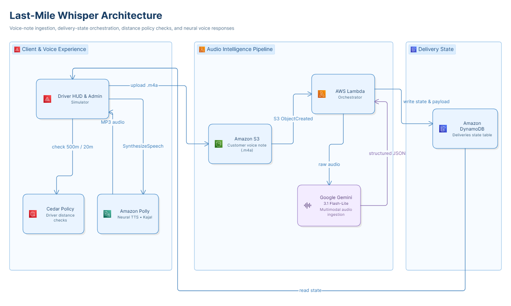

# 📦 Last-Mile Whisper

### Zero-friction, geo-fenced voice landmarks and multimodal TTS delivery infrastructure for hyper-local logistics in India

[](#-hackathon)
[](https://main.duyq18bdmhxrs.amplifyapp.com/)
[](#-technology)
[](#-technology)

> **Last-Mile Whisper turns a short customer voice note into privacy-aware landmarks, a driver-ready route script, and a geo-fenced digital doorbell—without making the driver call the customer just to find the building.**

🚀 **Live demo:** [main.duyq18bdmhxrs.amplifyapp.com](https://main.duyq18bdmhxrs.amplifyapp.com/)

---

## 🧩 Problem

Indian delivery addresses frequently depend on informal landmarks rather than structured coordinates:

> “Opposite Sharma Sweets, behind the peepal tree, red gate.”

When this information remains trapped in a voice note, delivery associates may need to stop, call a masked customer number, wait for directions, and repeat the process across many deliveries. This creates avoidable delays, interrupts customers, and exposes more customer contact than necessary.

Last-Mile Whisper moves the clarification work **earlier in the delivery lifecycle**. The customer's note is processed at checkout time, while landmark visibility and customer contact capabilities remain protected until the driver is physically close to the destination.

The result is a pre-computed, privacy-aware delivery experience: the driver receives the right information at the right distance, in both visual and spoken form.

---

## ✅ Solution

1. A customer records a short `.m4a` note such as: “Opposite Sharma Sweets, behind the peepal tree, red gate.”
2. The file is uploaded to Amazon S3.
3. An AWS Lambda orchestrator sends the **original audio directly to Google Gemini** through the `google-genai` SDK.
4. Gemini returns structured landmark data and a chronological `driver_audio_script`.
5. The driver HUD stays locked outside the delivery geofence.
6. At **500 m**, privacy-safe landmark tags become visible.
7. At **20 m**, the digital doorbell becomes available.
8. The driver can listen to the bilingual route summary using **Amazon Polly Neural TTS**.
9. If the customer does not respond after the configured retry flow, the system falls back to masked calling—unless the customer has enabled do-not-call.

The demo includes an **Admin Simulator** for switching seeded deliveries and previewing the original customer recording separately from the synthesized driver narration.

---

## 🏗️ Architecture



### End-to-end flow

1. **Capture:** The customer records a short voice note at checkout.
2. **Upload:** The audio is placed in Amazon S3.
3. **Trigger:** An S3 `ObjectCreated` event invokes the Lambda orchestrator.
4. **Understand:** Lambda sends the original audio directly to Google Gemini using the `google-genai` SDK, preserving the context and natural phrasing of the customer's voice note.
5. **Structure:** Gemini returns a constrained JSON payload containing landmarks, destination details, door instructions, do-not-call information, and `driver_audio_script`.
6. **Authorize:** Cedar evaluates the driver's distance and gates landmark visibility and doorbell activation independently.
7. **Persist:** Delivery state is written to DynamoDB, the HUD's source of truth.
8. **Speak:** On driver request, Lambda invokes Amazon Polly Neural with voice `Kajal` and returns MP3 audio for playback.
9. **Present:** The HUD renders high-contrast landmark tags and the digital doorbell state machine.

---

## 💡 What makes the project different

| Design choice | Why it matters |
|---|---|
| **Raw audio → multimodal Gemini** | Avoids a separate speech-to-text and translation pipeline, which is useful for noisy, code-switched Hinglish. |
| **Two independent geofenced capabilities** | A driver can receive useful approach landmarks at 500 m without receiving the doorstep interaction capability prematurely. |
| **Cedar-backed authorization** | Distance-based decisions are represented as explicit authorization policy rather than trusted solely to frontend JavaScript. |
| **Spoken driver route script** | The driver gets a chronological, hands-free summary rather than only a block of extracted text. |
| **Digital doorbell state machine** | Chimes, retries, notification opt-out, do-not-call, and masked-call fallback are modeled as an operational workflow. |
| **Admin and driver views** | The demo makes both the original input and the generated delivery experience inspectable. |

---

## 🔐 Core features

### 1. Multimodal audio ingestion

The system sends the original `.m4a` recording directly to Gemini through a compact multimodal pipeline. This preserves context and natural phrasing for code-switched Indian speech while producing structured delivery data and a driver-ready route script in one intelligent step.

### 2. Structured delivery output

Gemini produces a delivery-oriented payload rather than only a transcript:

- landmark and waypoint descriptions,
- destination and entrance details,
- door instructions,
- do-not-call status,
- chronological `driver_audio_script`.

The spoken script is generated alongside the structured data so the driver does not need a second summarization step.

### 3. Cedar geo-fence

The demo models two capabilities independently:

| Capability | Unlock distance | Result |
|---|---:|---|
| Landmark visibility | ≤ 500 m | Driver can see privacy-safe approach guidance. |
| Digital doorbell | ≤ 20 m | Driver can initiate the customer notification flow. |

The current demo uses a manual distance simulator. A production client would provide distance from the browser Geolocation API or a native driver application; the server-side authorization decision must remain authoritative.

### 4. Digital doorbell state machine

```text
DISTANCE > 20m
      │
      ▼
DISABLED: Locked by Cedar Policy
      │ distance ≤ 20m
      ▼
READY
      │ first tap
      ▼
RINGING_30S
      │ timeout / retry
      ▼
PING_AVAILABLE ── second retry ──► MAX_PINGS_EXCEEDED
                                      │
                                      ├─ do-not-call = false → MASKED_DIRECT_CALL
                                      └─ do-not-call = true  → NO_CALL_FALLBACK
```

If notifications are disabled, the UI skips the doorbell flow and presents the configured direct-call path. Customer preferences are respected throughout.

### 5. Driver HUD and Admin Simulator

The driver view provides:

- three visual landmark tags,
- distance-aware unlock states,
- `Listen to Route` Polly playback,
- doorbell chime and retry states,
- masked-call fallback behavior.

The Admin Simulator provides:

- seeded delivery switching,
- original customer audio preview,
- inspection of the generated delivery state.

The original recording and synthesized route narration are deliberately separate media paths.

---

## 🛠️ Technology

| Layer | Implementation |
|---|---|
| Compute | AWS Lambda; local API emulation with Python server / SAM workflows |
| Storage | Amazon S3; LocalStack S3 for local emulation |
| Database | Amazon DynamoDB `Deliveries`; LocalStack DynamoDB locally |
| AI extraction | Google Gemini `gemini-3.1-flash-lite` through `google-genai` |
| Voice synthesis | Amazon Polly Neural, voice `Kajal` |
| Authorization | Cedar Policy Engine and `cedar-policy-cli` |
| Infrastructure | AWS SAM CLI |
| Backend | Python 3.12, `boto3` |
| Frontend | HTML5, CSS3, vanilla JavaScript |
| Hosting | AWS Amplify live demo |

### Architecture highlight

The implementation uses Google Gemini for multimodal audio interpretation and AWS for the surrounding delivery infrastructure: storage, serverless orchestration, policy enforcement, persistence, hosting, and speech synthesis. This focused hybrid design keeps each responsibility with the platform best suited to it and makes the system straightforward to deploy and evolve.

**The multimodal intelligence layer is model-agnostic by design: Amazon Bedrock can be introduced as a future deployment option for organizations that prefer to run the same audio-understanding workflow through AWS-managed foundation models, while preserving the existing S3, Lambda, Cedar, DynamoDB, and Polly architecture.**

---

## 🚀 Run locally

### Prerequisites

- Python 3.12
- AWS SAM CLI, if using the SAM workflow
- LocalStack, if using local AWS service emulation
- `cedar-policy-cli`, if validating policies
- Google Gemini API key
- AWS credentials or LocalStack-compatible credentials

### Start LocalStack

```bash
localstack start -d
```

### Start the local API

```bash
python api_server.py
```

### Validate Cedar policies

```bash
cedar validate --policies policies/ --schema schema.cedarschema
```

### Build and deploy to AWS

```bash
sam build
sam deploy --guided
```

> The exact environment-specific resource names and deployment parameters should be taken from the repository's SAM template and configuration files. Never commit credentials or `.env` files.

---

## 🔑 Environment variables

| Variable | Purpose |
|---|---|
| `AWS_ACCESS_KEY_ID` | AWS authentication for local or deployment workflows. Prefer IAM roles or short-lived credentials in production. |
| `AWS_SECRET_ACCESS_KEY` | AWS secret credential paired with the access key. Never commit it. |
| `AWS_REGION` | AWS region for S3, DynamoDB, Lambda, and Polly. |
| `GOOGLE_GENAI_API_KEY` | Authentication for Gemini audio extraction. |
| `POLLY_VOICE_ID` | Polly voice; defaults to `Kajal`. |
| `DYNAMODB_TABLE_NAME` | Delivery state table name; defaults to the configured `Deliveries` table. |

For local emulation, use isolated LocalStack credentials and endpoints. Do not reuse production credentials in a local environment.

---

## 📊 Measurements and cost model

The figures below are **engineering estimates and design projections**, not claims of production traffic or independent benchmark certification. Actual performance varies with network conditions, Lambda warm state, Gemini service load, audio size, and Polly request behavior.

### Representative pipeline estimate

Assumption: one 15-second, approximately 200 KB `.m4a` recording and a short JSON response.

| Step | Estimated time | Notes |
|---|---:|---|
| Browser → S3 upload | 0.3–1.0 s | Network dependent. |
| S3 event delivery | 0.1–0.5 s | Event propagation varies. |
| Lambda cold start | 0.3–1.5 s | Warm invocations are lower. |
| Gemini extraction | 5.5–7.0 s | Estimate for the selected model and payload; measure in the target region before production claims. |
| DynamoDB write | usually under 10 ms | Small single-item write; network round trip included in real measurements. |
| **Upload → HUD-ready** | **approximately 6–10 s** | Asynchronous at checkout time, not on the driver's critical path. |
| Polly playback request | 0.8–1.5 s | Estimate for a short script; generated on driver request. |

The key product behavior is that processing happens before the driver reaches the delivery area. When the 500 m geofence is reached, the structured state is intended to already be available.

### Cost model

Illustrative calculation for one delivery, using the rates and assumptions in the original project model:

| Service | Assumption | Estimated cost |
|---|---|---:|
| S3 storage | 200 KB retained for 30 days | ~$0.0000046 |
| S3 PUT | one upload | ~$0.000005 |
| Lambda | 512 MB for 5 seconds plus request charge | ~$0.000042 |
| DynamoDB | one write and one read | ~$0.0000015 |
| Polly Neural | 275 characters at $16 per million characters | ~$0.0044 |
| Gemini | 400 input tokens and 175 output tokens at the stated model rates | ~$0.00036 |
| **Estimated total** | **if Polly is used for every delivery** | **~$0.0048–$0.0049** |

> **💡 Note on Cost Projections & Real-World Variability**  
> The largest cost variable at scale is Amazon Polly usage. The projection above assumes a 100% TTS request rate (275 characters per delivery), yielding ~82.5 million Polly characters and a strict upper-bound cost of ~$1,444/month for 300,000 deliveries. In a production environment, drivers will only request narration for a fraction of deliveries, which would significantly reduce this line item. 
> 
> *Disclaimer: This model serves as an architectural planning estimate rather than a definitive invoice forecast. It strictly calculates primary compute and API utilization, excluding secondary AWS overhead such as CloudWatch logs, data transfer/egress, system retries, support plans, taxes, and future provider pricing adjustments.*

---

## 🧪 Reliability, privacy, and safety

### Current design safeguards

- Landmark visibility and doorbell activation are separate capabilities.
- The demo includes a transparent distance simulator, with the authorization layer designed for secure device-location integration.
- Audio and delivery state are separated from the frontend presentation layer.
- Presigned upload URLs should be short-lived and scoped to the intended object.
- S3 public access should remain blocked.
- IAM permissions should be limited to the required buckets, table, Polly action, and Lambda resources.
- Voice recordings are designed to work with a defined retention/lifecycle policy.
- Phone contact should remain masked wherever the telephony integration supports it.
- Customer do-not-call preference is carried through the doorbell state machine.

### AI quality and operational safeguards

AI-generated landmarks are derived directly from the customer's audio and are structured for dependable delivery assistance. The quality workflow:

1. validate the returned JSON schema;
2. retain the original recording for controlled review;
3. support confidence-aware review workflows for ambiguous notes;
4. keep generated landmarks clearly associated with the customer-provided audio;
5. provide a customer-support or clarification path when additional context is needed.

This creates a strong foundation for dependable AI-assisted delivery operations while preserving a clear path for human review.

### Production-readiness roadmap

The demo already establishes the core delivery experience. The following enhancements are the natural next steps for a production rollout:

- Connect the geofence to signed device-location updates.
- Add confidence scores and a review queue for ambiguous landmarks.
- Add idempotency keys for duplicate S3 events.
- Add automated integration tests for every Cedar state transition.
- Add CloudWatch dashboards, structured logs, tracing, and dead-letter queues.
- Add configurable retention and deletion workflows for voice recordings.
- Measure landmark extraction quality on a consented, representative Hinglish dataset.
- Run a delivery-partner pilot measuring clarification calls, delivery time, and first-attempt success rate.

---

## 📈 Scalability considerations

For a planning scenario of 10,000 deliveries/day, the architecture is designed around asynchronous S3-triggered processing and small DynamoDB items. Before production, validate:

- Lambda concurrency and retry behavior;
- Gemini API quotas and rate limits;
- Polly request quotas and burst behavior;
- DynamoDB hot-key and access-pattern behavior;
- S3 lifecycle expiration and storage growth;
- end-to-end latency during the 6–9 PM peak;
- duplicate S3 event handling and idempotency;
- CloudWatch logs, metrics, tracing, and dead-letter handling.

The right production claim is not that default quotas are automatically sufficient; it is that the system has clear service boundaries and can be load-tested and quota-tuned independently.

---

## 🧠 Engineering decisions

| Challenge | Decision |
|---|---|
| Code-switched voice notes | Send original audio directly to a multimodal model for context-preserving extraction and route generation. |
| Multi-cloud capability selection | Use Gemini for multimodal audio understanding while keeping AWS as the delivery infrastructure layer. |
| Privacy before arrival | Gate landmark visibility and doorbell activation with different distance thresholds. |
| Policy maintainability | Keep authorization rules in Cedar rather than embedding every decision in UI conditionals. |
| Local/cloud parity | Use LocalStack-compatible S3 and DynamoDB paths while retaining deployable AWS SAM infrastructure. |
| Infrastructure dependencies | Keep resource provisioning explicit and deterministic in the SAM deployment. |
| Driver attention | Generate a concise route script that can be played through Polly rather than requiring screen reading. |
| AI quality control | Validate structured output and support review workflows for ambiguous delivery notes. |

---

## 🏆 Hackathon

Built for the **AWS & WeMakeDevs Bharat Build First Commit Hackathon**.

Last-Mile Whisper is a production-shaped hybrid system: Google Gemini handles multimodal audio understanding, while AWS provides storage, serverless orchestration, authorization integration, persistence, hosting, and speech synthesis. The project combines a working end-to-end demo with a clear, measurable path toward production deployment.


